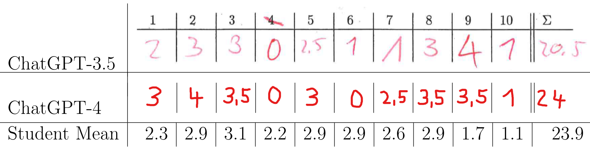

## ChatGPT Participates in a Computer Science Exam

  

This repository contains the transcript of the conversations with ChatGPT. It accompanies the paper [ChatGPT Participates in a Computer Science Exam](https://arxiv.org/abs/2303.09461) by Sebastian Bordt and Ulrike von Luxburg.

The folder [GPT-3.5](https://github.com/tml-tuebingen/chatgpt-algorithm-exam/tree/main/GPT-3.5) contains the transcript from 16.2.2023 using GPT-3.5. These are the responses that were blindly graded alongside the student responses.

The folder [GPT-4](https://github.com/tml-tuebingen/chatgpt-algorithm-exam/tree/main/GPT-4) contains a transcript from 19.3.2023, replicating the original analysis with GPT-4. 

In the folders, every text file contains the transcript of one conversation. The names of the text files correpond to the exercise numbers in the exam.
